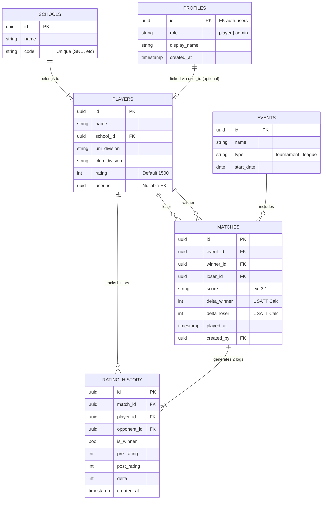
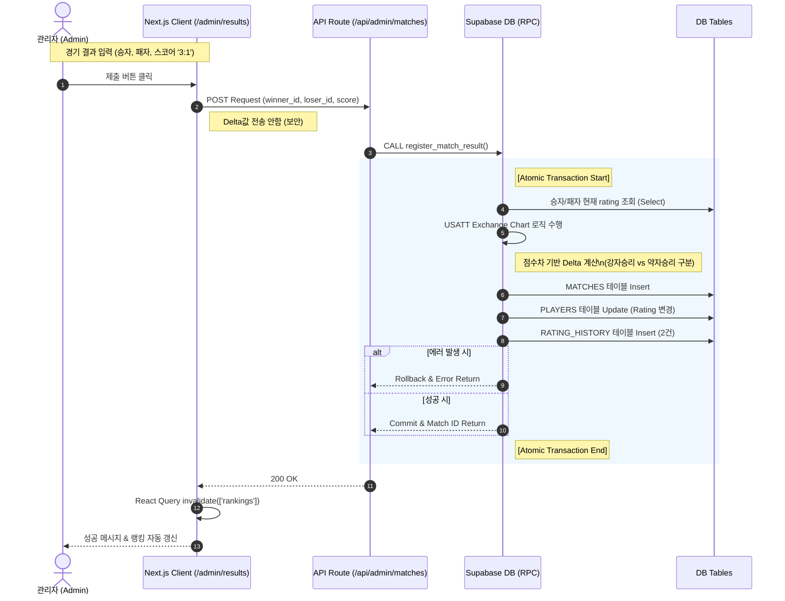
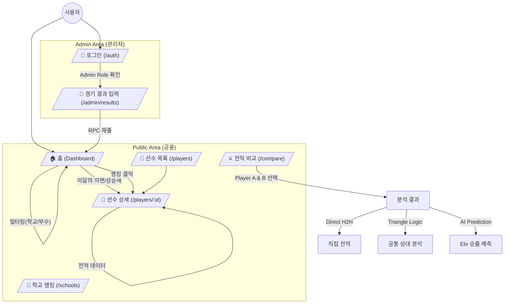
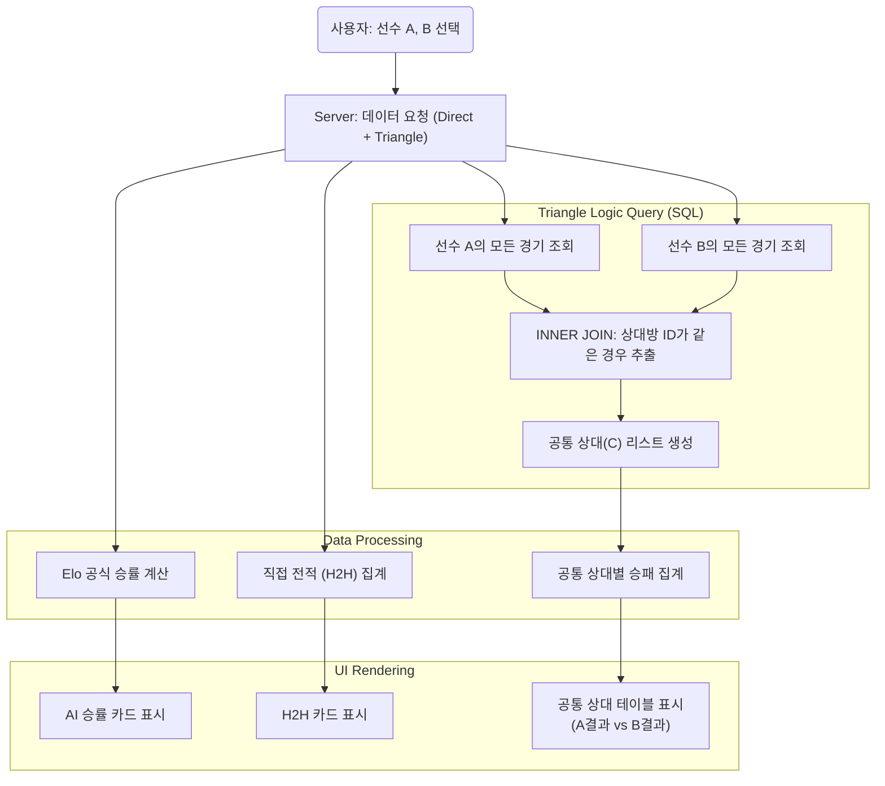

# TakuRating System Architecture & Logic Flows

이 문서는 **TakuRating(대학 탁구 레이팅 시스템)**의 데이터베이스 구조, 핵심 로직 처리 흐름, 그리고 사용자 경험(UX) 설계를 시각화한 다이어그램 모음입니다.

---

## 1. Entity Relationship Diagram (ERD)
Supabase 데이터베이스의 스키마 구조입니다. `PLAYERS` 테이블을 중심으로 학교, 경기 기록, 레이팅 히스토리가 연결되며, **무결성**을 위해 모든 참조는 Foreign Key로 관리됩니다.

 

## 2. Match Result Processing (Sequence Diagram)
관리자가 경기 결과를 입력했을 때 발생하는 **트랜잭션 흐름**입니다. 클라이언트는 단순 데이터만 전송하며, 핵심 로직(USATT 점수 계산, 레이팅 갱신)은 **Supabase RPC(Server-side)**에서 원자적(Atomic)으로 처리됩니다.

 

## 3. User Experience & Navigation Flow
일반 사용자와 관리자의 웹사이트 이용 흐름도(Sitemap)입니다. 대시보드를 중심으로 전적 비교, 선수 상세 정보 등으로 이동하는 구조를 가집니다.

 

## 4. Compare & Triangle Logic Algorithm
TakuRating의 핵심 기능인 **'전적 비교'** 알고리즘입니다. 두 선수의 직접 전적뿐만 아니라, **공통 상대(Triangle Logic)**를 찾아 간접 비교 데이터를 생성하는 과정을 나타냅니다.

## 5. Player Detail Logic Flow (Client-Side Rendering)
이 로직은 `/players/[id]` 페이지 진입 시 실행됩니다.

1. **Data Fetching:**
    * Fetch `Player Info` (Name, Divisions, Current Rating).
    * Fetch `Match History` (Date, Opponent Name, Scores, Result, Rating Change).
    
2. **Graph Data Processing (Bi-weekly):**
    * Raw Match History 데이터를 날짜순 정렬.
    * 데이터를 2주 단위(Bi-weekly)로 그룹화.
    * 각 기간의 **마지막 레이팅**을 추출하여 그래프 데이터 포인트 생성. (점과 점 사이를 선으로 연결)

3. **History List Rendering:**
    * **Condition Check:** Am I the winner?
    * **IF Winner:** Apply Green Style. Display `Me (Score) : (Score) Opponent`.
    * **IF Loser:** Apply Red Style. Display `Me (Score) : (Score) Opponent`.
    * **Link:** Wrap Opponent Name with `<Link href="/players/[opponent_id]">`.
    